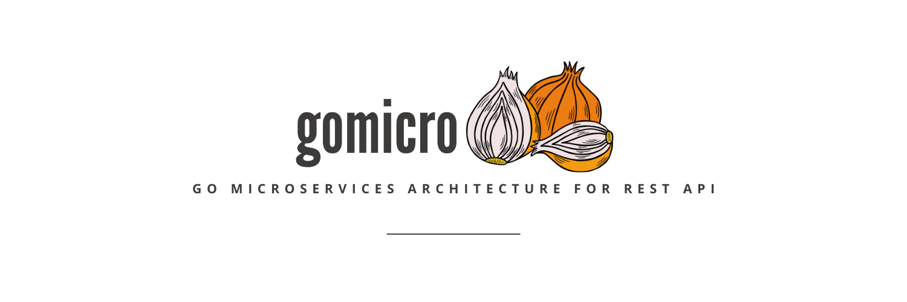

# gomicro - Go Microservices Architecture

## Create a Blog service using goserve micro

# Framework
- goserve micro architecture

## Highlights
- kong API gateway
- nats for microservices communication
- custom kong go plugin for apikey validation
- docker and docker-compose
- mongo
- redis

